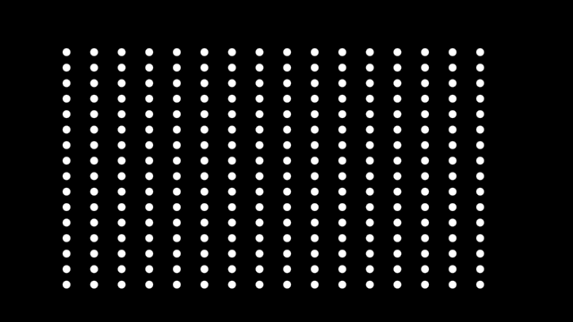
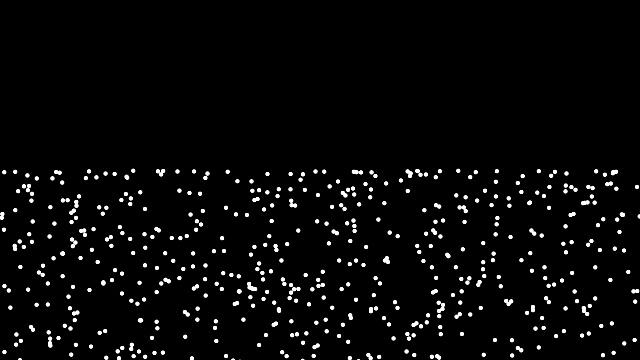
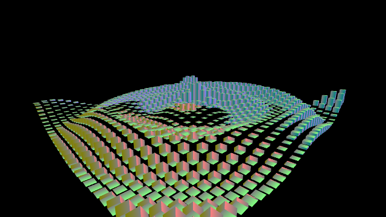

GitHub: [https://github.com/kenjiSpecial/tubugl-gpgpu](https://github.com/kenjiSpecial/tubugl-gpgpu)

### [#00 - rending particle with swapRendinging](./app00/index.html)

[codes](https://github.com/kenjiSpecial/tubugl-gpgpu/tree/master/examples/app00) | [sources for SwapRendering](https://github.com/kenjiSpecial/tubugl-gpgpu/blob/master/src/swapRenderer.js)

### [#01 - rending particle with swapRendinging(velocity and position)](./app01/index.html)

[codes](https://github.com/kenjiSpecial/tubugl-gpgpu/tree/master/examples/app01) | [sources for SwapRendering](https://github.com/kenjiSpecial/tubugl-gpgpu/blob/master/src/swapRenderer.js)

### [#02 - rending of cube with singleDrawCall ](./app02/index.html)

[codes](https://github.com/kenjiSpecial/tubugl-gpgpu/tree/master/examples/app02) | [sources for SwapRendering](https://github.com/kenjiSpecial/tubugl-gpgpu/blob/master/src/swapRenderer.js)

### [#03](./app03/index.html)

[codes](https://github.com/kenjiSpecial/tubugl-gpgpu/tree/master/examples/app03) | [sources for SwapRendering](https://github.com/kenjiSpecial/tubugl-gpgpu/blob/master/src/swapRenderer.js)

### [#04](./app04/index.html)

[codes](https://github.com/kenjiSpecial/tubugl-gpgpu/tree/master/examples/app04) | [sources for SwapRendering](https://github.com/kenjiSpecial/tubugl-gpgpu/blob/master/src/swapRenderer.js)

all examples were made with [tubugl](https://github.com/kenjiSpecial/tubugl)
